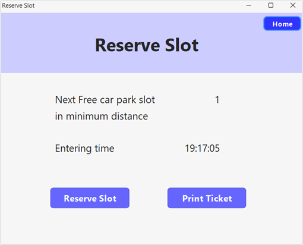
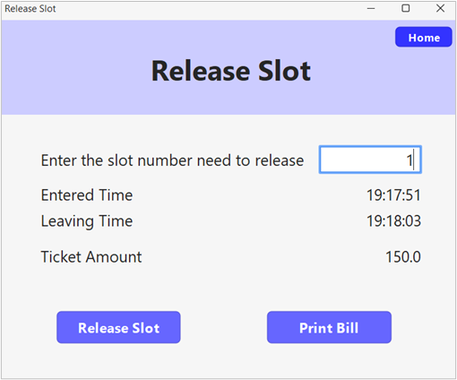
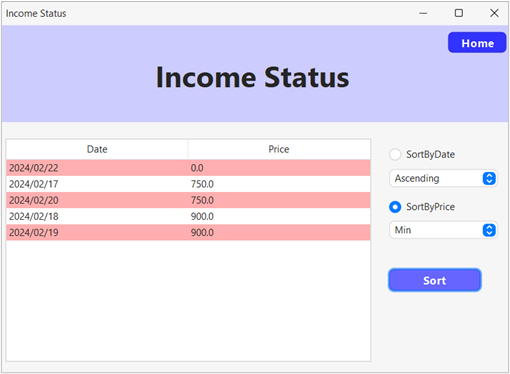
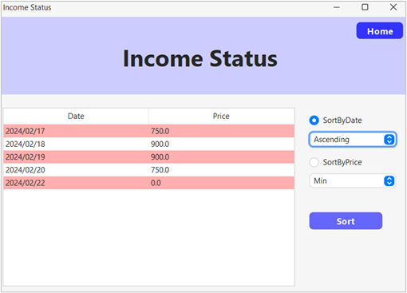

# Car Park Ticket Issuing System

**ABC Car Park** is a simple and lightweight program written in Java to facilitate shortest distance parking slot to the next customer.

## Features of the Application

* Ability to find the minimum distance parking slot available.
* Stores entering and leaving time of a customer with their ticket price.
* Computerized ticket price calculations.
* Calculate daily income.
* Store organizes incomes according to their date.
* Facilitates organizing income according to highest or minimum prices or ascending or descending of dates.

## Requirements of the Project

- **Inputs**
  - Initial Numbers for the parking slots are inserted into the heap.
  - Enter time of a customer is inserted to the matching slot in the AVL tree.
  - Slot numbers are entered to the system when customers are leaving.
  - Enter time, leave time and the ticket price of customer is entered into doubly linked list.
  - Daily incomes are provided to the sorting algorithm.

- **Processes**
  - Finds the minimum numbered parking slot using heap.
  - Searching AVL tree to find the entered time of a parking slot.
  - Calculating ticket price using entered time and current time.
  - Calculating the daily income.
  - Organizing daily incomes using sorting techniques.

- **Outputs**
  - Returns the entered time of a customer.
  - Display the minimum numbered parking slot.
  - Display calculated ticket price.
  - Display daily incomes in sorted order.

## Data Structures & Algorithms used in the Application

* Minimum Heap
* AVL Tree
* Doubly Linked List
* Merge Sort Algorithm

## User Interfaces of the Application

  
## AUTHOR 🖋

* [Pubudu Perera]( https://github.com/Pamod45)

## Contributors 🏅

* [Vishan Perera]( https://github.com/VishanPerera)

* [Nisal Wickramaarachchi]( https://github.com/Nisal200212)

## CONTACT 📞

* Pubudu Perera -> [pubupere32@gmail.com](mailto:pubupere32@gmail.com)
